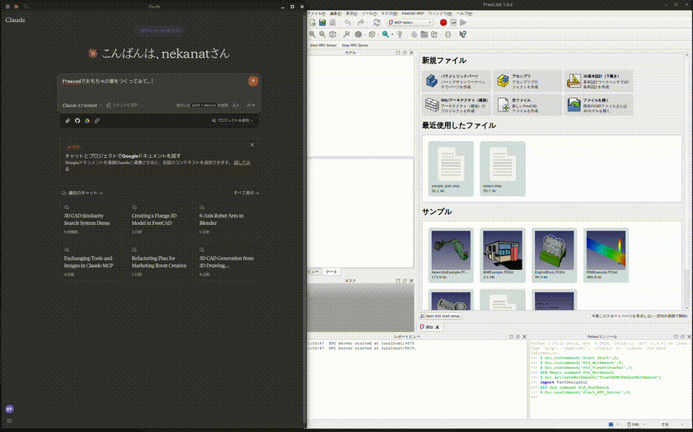
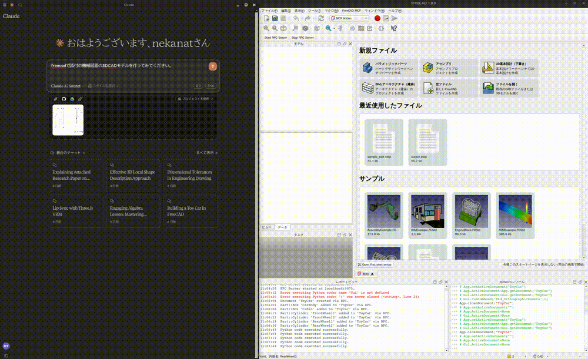
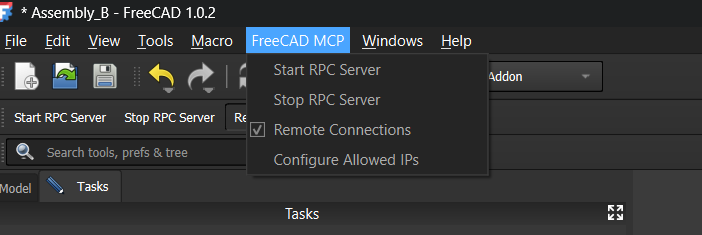

# FreeCAD MCP

Drive FreeCAD from any MCP client — parametric modelling, sketching, assemblies,
FEM analysis and technical drawings, exposed as MCP tools.

> **Canonical home:** [codeberg.org/wibbit/freecad-mcp](https://codeberg.org/wibbit/freecad-mcp)
> Please file issues and pull requests there.

## Demo

The recordings and shared conversation below were produced by the upstream
project ([`neka-nat/freecad-mcp`](https://github.com/neka-nat/freecad-mcp)) and are
reproduced here to show the general idea; they are not output from this fork.

### Design a flange


### Design a toy car



### Design a part from 2D drawing

#### Input 2D drawing


#### Demo



This is the conversation history.
https://claude.ai/share/7b48fd60-68ba-46fb-bb21-2fbb17399b48

## Install addon

FreeCAD Addon directory is
* Windows: `%APPDATA%\FreeCAD\Mod\`
* Mac:
  * FreeCAD 1.1: `~/Library/Application\ Support/FreeCAD/v1-1/Mod/`
  * FreeCAD 1.0: `~/Library/Application\ Support/FreeCAD/v1-0/Mod/`
* Linux:
  * Ubuntu: `~/.FreeCAD/Mod/` or `~/snap/freecad/common/Mod/` (if you install FreeCAD from snap)
  * Debian: `~/.local/share/FreeCAD/Mod`
  * Arch / CachyOS (FreeCAD 1.1 from `extra/freecad`): `~/.local/share/FreeCAD/v1-1/Mod/`
  * Flatpak: `~/.var/app/org.freecad.FreeCAD/data/FreeCAD/v1-1/Mod/`

Please put `addon/FreeCADMCP` directory to the addon directory.

```bash
git clone https://codeberg.org/wibbit/freecad-mcp.git
cd freecad-mcp

# For Linux (Ubuntu/Debian)
cp -r addon/FreeCADMCP ~/.FreeCAD/Mod/

# For Linux (Arch/CachyOS, FreeCAD 1.1 from extra/freecad)
mkdir -p ~/.local/share/FreeCAD/v1-1/Mod/
cp -r addon/FreeCADMCP ~/.local/share/FreeCAD/v1-1/Mod/

# For Linux (Flatpak)
mkdir -p ~/.var/app/org.freecad.FreeCAD/data/FreeCAD/v1-1/Mod/
cp -r addon/FreeCADMCP ~/.var/app/org.freecad.FreeCAD/data/FreeCAD/v1-1/Mod/

# For macOS (FreeCAD 1.1)
cp -r addon/FreeCADMCP ~/Library/Application\ Support/FreeCAD/v1-1/Mod/
```

When you install addon, you need to restart FreeCAD.
You can select "MCP Addon" from Workbench list and use it.


And you can start RPC server by "Start RPC Server" command in "FreeCAD MCP" toolbar.



### Auto-Start RPC Server

By default, the RPC server must be started manually each time FreeCAD opens. To start it automatically:

1. Open the **FreeCAD MCP** menu (switch to the MCP Addon workbench first)
2. Check **Auto-Start Server**

The setting is saved to `freecad_mcp_settings.json` and persists across sessions. On the next FreeCAD launch, the RPC server will start automatically once the application finishes loading.

You can disable it at any time by unchecking **Auto-Start Server** in the same menu.

## Setting up an MCP client

Pre-installation of the [uvx](https://docs.astral.sh/uv/guides/tools/) is required.

> **Do not run a bare `uvx freecad-mcp`.** That name resolves on PyPI to a
> different, unrelated package (the upstream project's release), which does not
> provide this project's tools. This project is not published to PyPI — install it
> straight from Codeberg with `--from git+https://codeberg.org/wibbit/freecad-mcp`,
> exactly as shown in every example below.

Then configure your MCP client.

### Claude Code (CLI)

```bash
claude mcp add freecad -- uvx --from git+https://codeberg.org/wibbit/freecad-mcp freecad-mcp
```

Or edit `~/.claude.json` directly, using the same `mcpServers` block shown below.

### Claude Desktop

Edit `claude_desktop_config.json`:

For user.

```json
{
  "mcpServers": {
    "freecad": {
      "command": "uvx",
      "args": [
        "--from", "git+https://codeberg.org/wibbit/freecad-mcp",
        "freecad-mcp"
      ]
    }
  }
}
```

If you want to save token, you can set `only_text_feedback` to `true` and use only text feedback.

```json
{
  "mcpServers": {
    "freecad": {
      "command": "uvx",
      "args": [
        "--from", "git+https://codeberg.org/wibbit/freecad-mcp",
        "freecad-mcp",
        "--only-text-feedback"
      ]
    }
  }
}
```


For developer.
First, you need clone this repository.

```bash
git clone https://codeberg.org/wibbit/freecad-mcp.git
```

```json
{
  "mcpServers": {
    "freecad": {
      "command": "uv",
      "args": [
        "--directory",
        "/path/to/freecad-mcp/",
        "run",
        "freecad-mcp"
      ]
    }
  }
}
```

## Remote Connections

By default the RPC server does not accept remote connections and listens on `localhost`. To control FreeCAD from another machine on your network:

### 1. Enable remote connections in FreeCAD

In the **FreeCAD MCP** toolbar:

1. Check **Remote Connections** — the RPC server will bind to `0.0.0.0` (all interfaces) on the next restart. For security reasons, it only accepts connections from the IP addresses or CIDR subnets specified in the **Allowed IPs** field. By default this is `127.0.0.1`.
2. Click **Configure Allowed IPs** and enter a comma-separated list of IP addresses or CIDR subnets that are allowed to connect, e.g.:

   ```
   192.168.1.100, 10.0.0.0/24
   ```

   `127.0.0.1` is always the default. Invalid entries are rejected with an error dialog. Restart the RPC server after changing these settings.

### 2. Point the MCP server at the remote host

Pass the `--host` flag with the IP address or hostname of the machine running FreeCAD:

```json
{
  "mcpServers": {
    "freecad": {
      "command": "uvx",
      "args": [
        "--from", "git+https://codeberg.org/wibbit/freecad-mcp",
        "freecad-mcp",
        "--host", "192.168.1.100"
      ]
    }
  }
}
```

The `--host` value is validated on startup — it must be a valid IPv4/IPv6 address or hostname.

## Features

| Group | Covers |
|---|---|
| Documents & objects | create/load/save/close, object CRUD, rename, copy, visibility, undo, status |
| Sketching | sketches on plane/face/body, datum planes, contour building, attachment |
| Sketch-based features | pad/extrude (bidirectional), pocket, groove |
| Solid modelling | loft, revolve, sweep, tube, 3D splines, fillet, chamfer, shell |
| Transform & pattern | transform, align, mirror, linear and circular patterns, reference planes/axes |
| Booleans | union, cut, intersection |
| Assembly | Assembly3 (constraints + solver), Assembly4 (LCS-based), parts library, BOM, assembly export |
| FEM | CalculiX-driven stress analysis |
| TechDraw | pages, views, dimensions |
| Import & export | STEP, DXF, airfoil profiles, object export |
| Inspection | viewport capture, shape topology, measurement, FreeCAD error log access |
| Spreadsheets | read and write |
| Escape hatch | `execute_code` for operations without a dedicated tool |
| Guided prompts | workflow prompts for session startup, sketching, booleans, assembly, primitives and FEM |

Full signatures and examples: [`docs/API_REFERENCE.md`](docs/API_REFERENCE.md).

## A few tools at a glance

A small, illustrative selection — **not** the full tool surface. The Features table
above summarises the whole surface, and
[`docs/API_REFERENCE.md`](docs/API_REFERENCE.md) lists every tool with signatures and
examples.

* `create_document`: Create a new document in FreeCAD.
* `create_object`: Create a new object in FreeCAD.
* `edit_object`: Edit an object in FreeCAD.
* `delete_object`: Delete an object in FreeCAD.
* `execute_code`: Execute arbitrary Python code in FreeCAD.
* `insert_part_from_library`: Insert a part from the [parts library](https://github.com/FreeCAD/FreeCAD-library).
* `get_view`: Get a screenshot of the active view.
* `get_objects`: Get all objects in a document.
* `get_object`: Get an object in a document.
* `get_parts_list`: Get the list of parts in the [parts library](https://github.com/FreeCAD/FreeCAD-library).
* `run_fem_analysis`: Run the CalculiX solver on an existing `Fem::FemAnalysis` and return summary results (max von Mises stress, max displacement, node count, working directory). Auto-creates a `SolverCcxTools` if the analysis has none. See [`examples/cantilever_fem.py`](examples/cantilever_fem.py) for an end-to-end usage example.

## Contributors

- **Shirokuma (k tanaka)** — author of the upstream project this is based on
- **Douglas Furlong** — maintainer
- **Martin Bruno** — advanced modelling, sketch workflow, assembly and boolean tooling
- **MichaelZag** — GUI defaults and startup quality-of-life improvements

## Origins

This project began as a fork of
[`neka-nat/freecad-mcp`](https://github.com/neka-nat/freecad-mcp) by
**Shirokuma (k tanaka)**, whose work is the foundation everything here is built on.

It has since diverged and is developed and maintained independently, with its own
tool surface, documentation and release history. It is not affiliated with, nor
endorsed by, the upstream project.

The original MIT licence and copyright notice are retained in full — see
[`LICENSE`](LICENSE).
